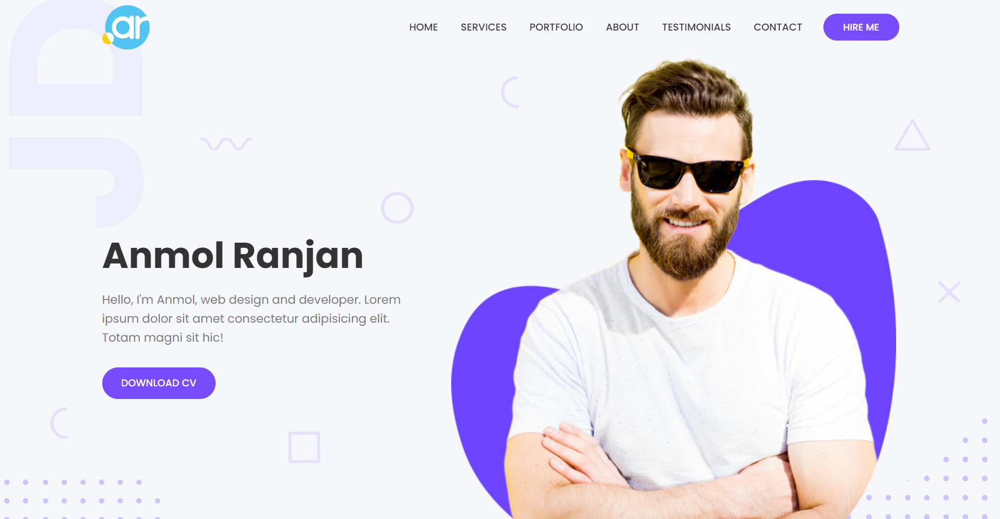
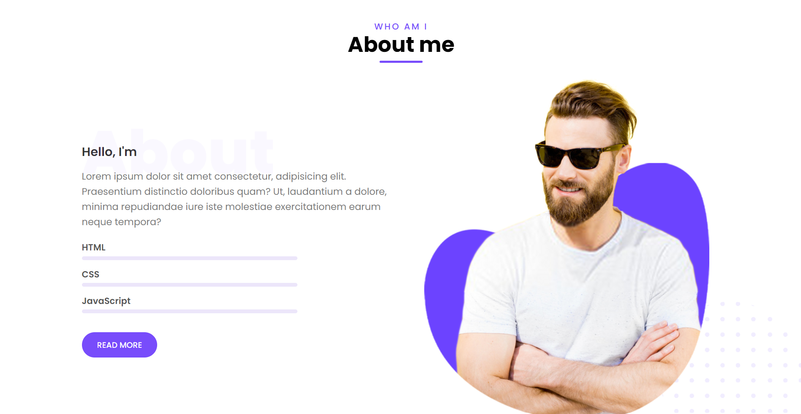

# TJ-Tasks-2022-Anmol-Ranjan

## For TechnoJam Auditions

## Tasks Done:- 
### DSA-CP
- Easy Tasks - 4
- Medium Tasks - 3

### Web Development
- Easy
- Medium

---

# Web_Development

## Easy: 

   
**[⬆ back to top](#web_development)**
    
### Output:

   
**[⬆ back to top](#web_development)**

## Medium:

**[⬆ back to top](#web_development)**

**[⬆ back to top](#web_development)**
